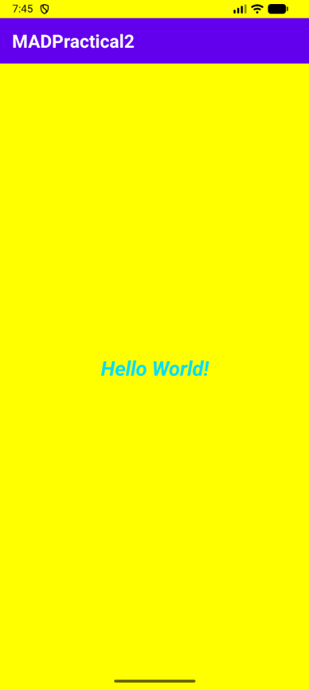
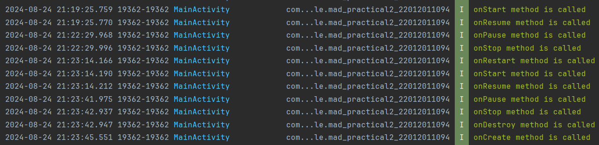

# MAD Practical 2: Android Activity Lifecycle & Notification Demonstration

## 📄 Submission Information
- **Student Name:** Maharsh Patel
- **Enrollment No.:** 24012011102
- **Batch:** 5H-1
- **Branch:** Computer Engineering (CE)
- **Course:** Mobile Application Development (MAD)
- **Repository URL:** [https://github.com/maharsh-patel/MAD_24012011102_Practical_2](https://github.com/maharsh-patel/MAD_24012011102_Practical_2)

---

## 📌 Project Overview
This repository contains Practical 2 for the Mobile Application Development (MAD) course. The objective of this practical is to demonstrate and understand the **Android Activity Lifecycle** callback methods, and display notifications across different states using:
1. **Logcat Logging (`Log.i`)**
2. **Toast Notifications (`Toast.makeText`)**
3. **Snackbar Messages (`Snackbar.make`)**

---

## 🚀 Features & Lifecycle Callbacks
The application overrides all major Activity lifecycle methods in [`MainActivity.kt`](app/src/main/java/com/example/mad_practical2_24012011102/MainActivity.kt):

- `onCreate()`: Called when the activity is first created. Initializes edge-to-edge UI layout and window insets.
- `onStart()`: Called when the activity becomes visible to the user.
- `onResume()`: Called when the activity starts interacting with the user.
- `onPause()`: Called when the activity loses focus or is partially obscured.
- `onStop()`: Called when the activity is no longer visible to the user.
- `onRestart()`: Called after the activity has been stopped, prior to it being started again.
- `onDestroy()`: Called before the activity is destroyed.

Each callback invokes a unified helper function `display(msg)` which logs the event to Logcat and displays both a Toast and a Snackbar on screen.

---

## 📸 Screenshots & Output

| App UI Output | Logcat Execution Logs |
| :---: | :---: |
|  |  |

---

## 🛠️ Built With
- **Language:** Kotlin
- **IDE:** Android Studio
- **UI Design:** ConstraintLayout, Material Components
- **Build System:** Gradle (Kotlin DSL)
- **Target SDK:** Android 34 / 35

---

## 💻 Setup & Installation
1. Clone the repository:
   ```bash
   git clone https://github.com/maharsh-patel/MAD_24012011102_Practical_2.git
   ```
2. Open the project in **Android Studio**.
3. Sync Gradle dependencies.
4. Run the app on an Android Emulator or connected physical device.
5. Open **Logcat** in Android Studio and filter by `tag:MainActivity` to monitor lifecycle events in real time.
